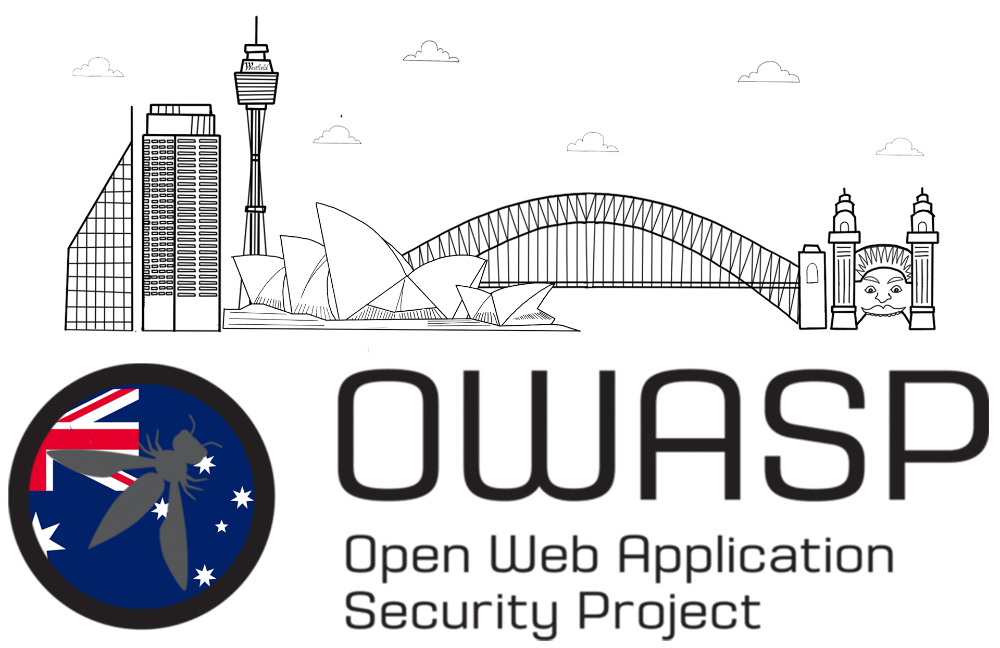

---

layout: col-sidebar
title: OWASP Sydney
tags: sydney
level: 0

region: Oceania
meetup-group: OWASP-Sydney-Chapter
country: Australia
postal-code:

---

## Welcome
Welcome to the OWASP Sydney Chapter home page!

The OWASP Sydney Chapter was active in 2019 and is being rebooted in 2020. We organise local events throughout the year.

The chapter leaders are Ric Campo, Jack Gifford, and Sherry Liu.

## Our Goals
***Equality***  
We aim to bring together people from research, academia and industry to motivate, and empower others to pursue a career in cybersecurity. By raising awareness against discrimination within the workforce, we work towards increasing diversity and equality in cybersecurity.

***Education***  
We are committed to helping discover the next generation of cybersecurity talent. We aim to offer mentorship programs to educate those new to cybersecurity, and provide talks from industry professionals to showcase all cybersecurity has to offer.

***Community***  
We want to help you connect with like-minded individuals. Whether you are new to cybersecurity or a seasoned veteran, our goal is to build a community where everyone can openly discuss and explore current issues in cybersecurity, employment opportunities and more. By providing networking opportunities, we want everyone to get involved in the community and establish relationships with new people.

***Workshops***  
No cybersecurity summit would be complete without CTF events! We aim to hold an annual end of year competition where participants compete for a shot at glory and a cash prize.

## Upcoming Events

<section style='background-color:#f3f4f6;'>
    <strong>Event:</strong> Informal Get Together - Fight Club  
    <strong>Proposed Date:</strong> 16th July 2021 
</section> 

<section style='background-color:#f3f4f6;'>
    <strong>Event:</strong> Pentesting Using The Browser Developer Tool - Online Presentation  
    <strong>Proposed Date:</strong> 21st August 2021 
</section> 

<section style='background-color:#f3f4f6;'>
    <strong>Event:</strong> Informal Get Together - Fight Club  
    <strong>Proposed Date:</strong> 18th September 2021 
</section> 

Follow us on our socials to stay updated, we are on MeetUp, LinkedIn, Facebook, and Discord.

## Interested In Speaking?
We are always open to speakers who want to present a talk that aligns with our Chapter goals. If you are interested, please email your proposed topic, abstract, and brief speaker bio to [Ric Campo](mailto:ric.campo@owasp.org).

## OWASP Statement on Participation
The Open Web Application Security Project (OWASP) is a nonprofit foundation that works to improve the security of software. All of our projects ,tools, documents, forums, and chapters are free and open to anyone interested in improving application security.

Chapters are led by local leaders in accordance with the [Chapter Leader Handbook](/www-policy/rules-of-procedure/chapter-handbook). Financial contributions should only be made online using the authorized online donation button. To be a SPEAKER at ANY OWASP Chapter in the world simply review the [speaker agreement](/www-policy/speaker-agreement) and then contact the local chapter leader with details of what OWASP Project, independent research, or related software security topic you would like to present.

Everyone is welcome and encouraged to participate in our [Projects](/projects), [Local Chapters](/chapters), [Events](/events), [Online Groups](https://groups.google.com/a/owasp.com/), and [Community Slack Channel](https://owasp.slack.com/). We especially encourage diversity in all our initiatives. OWASP is a fantastic place to learn about application security, to network, and even to build your reputation as an expert. We also encourage you to be [become a member](/membership) or consider a [donation](/donate) to support our ongoing work.
